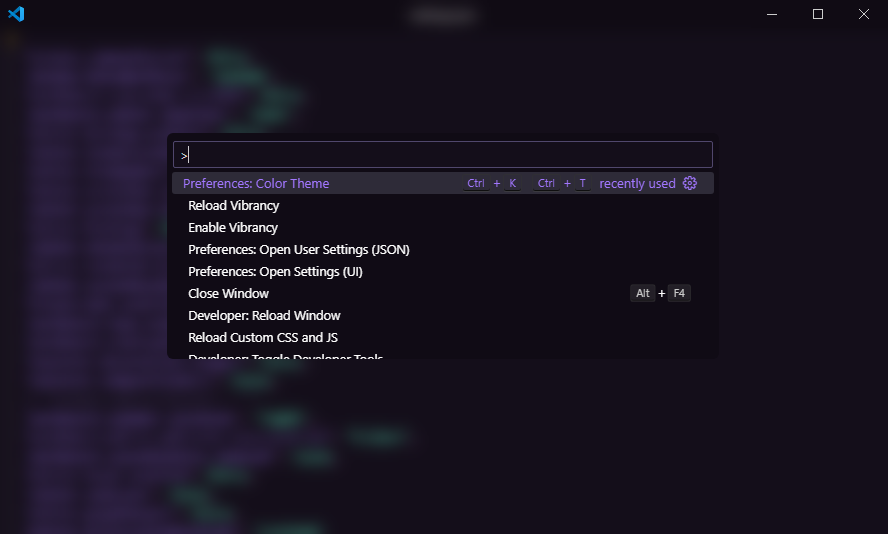

# VS Code Minimalist Ui
A minimalist, distraction-free Visual Studio Code interface inspired by [@igorbabko](https://www.github.com/igorbabko)



## Features

- **Hidden Activity Bar** - The side activity bar is completly hidden to reduce distractions.
- **No Shadows** - All interface shadows are removed for a cleaner fallter look.
- **Centered Command Palette** - The command palette opens neatly centered in the window.
- **Frosted Blue Effect** - A subtle blur effect under the command palette for modern aesthetics.
- **Minimal Ui Tweaks** - Additional Uielements are hidden or refined for simplicity.

## Installation 

### 1. Prerequisited 
 -  VS Code Installed.
 - [CSS and JS Loader Extension](https://marketplace.visualstudio.com/item?Name=be5invis.vscode-custom-css)

### 2. Download the settings
Clone or download this repo to your mschine.

```bash 
git clone https://www.github.com/pawanhirumina/vscode-theme.git
```
Or download the ZIP and extract it.

### 3. Apply the `settings.json` File

1. Open VS Code.
2. Go to `File` > `Preferences` > `Settings`
3. Click the **Open Settings (JSON)** icon in the top-right corner.
4. Replace the existing content with the contents of the `settings.json` file from this repo.
5. Save the file.

### $. Load Custom CSS and JS.

1. Place your `main.css` and `main.js` file somewhere accessible on your local system.
2. Open your `settings.json` again.
3. Add of modify this section:
```json 
"vscode_custom_css.imports": [
    "file:///e:/github-projects/vscode-theme/main.js",
    "file:///e:/github-projects/vscode-theme/main.css"
  ],
  ```

  > NOTE: Replace the paths with the actual full file paths to your CSS and JS files. Use `file://` and forward slashes even on Windows

  ### 5. Enable Custom Styles 
  You may need to allow custom styles for the loader to work

  -  Press `Ctrl + Shift + p` and type `Reload Custom CSS and JS` and then type `Developer: Reload Window`


#### Troubleshooting 
- Ensure paths in `settings.json` use forward slashes and begin with `file://`.
- if Nothing is applied, check that the **CSS and JS Loader** extension is enabled and VS Code was started with the correct flags. 